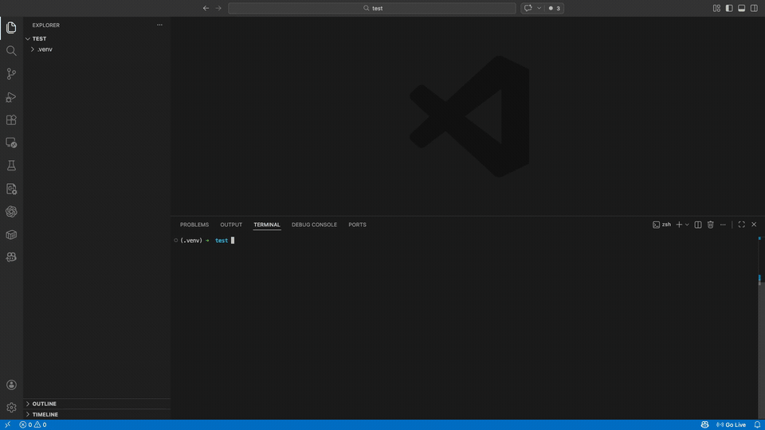

# Datapipeline Runtime

Jerry Thomas is a time-series data pipeline runtime. It reads source data,
maps it into ordered record streams, applies declarative transforms, and serves
feature vectors for analysis or model training.

The runtime is iterator-first: streams are processed on demand, with explicit
sorting, artifacts, observability, and plugin entry points for custom loaders,
parsers, mappers, and transforms.

Contributing: PRs welcome on [GitHub](https://github.com/mr-lovalova/datapipeline).

> **Core assumptions**
>
> - Every record carries a timezone-aware `time` attribute. Time-zone awareness
>   is a quality gate for correct vector assembly.
> - Samples are grouped by `sample.cadence`/`group_by`, plus optional
>   `sample.keys` such as `security_id`.
> - Stream state is partitioned with `partition_by` when transforms need
>   per-entity history. Feature-id suffixing is configured separately with
>   `feature_id_by`.

---

## Quick Demo

From zero to served vectors in under a minute.



```bash
jerry demo init
python -m pip install -e demo
jerry serve -n 1
```

---

## Why You Might Use It

- Materialize canonical time-series datasets from disparate sources.
- Preview and debug each stage of the pipeline without writing ad-hoc scripts.
- Enforce coverage/quality gates and publish artifacts (schema, scaler stats)
  for downstream ML teams.
- Extend the runtime with entry-point driven plugins for domain-specific I/O or
  feature engineering.
- Consume vectors directly from Python via iterators, Pandas DataFrames, or
  `torch.utils.data.Dataset`.

---

## Quick Start

### Serve The Demo Plugin (Recommended)

```bash
python -m pip install -U jerry-thomas
jerry demo init
python -m pip install -e demo
jerry serve --dataset demo --limit 3
```

Note: `jerry demo init` creates a workspace `jerry.yaml`. If you later run
`jerry plugin init`, it won’t overwrite that file. Remove or edit
`jerry.yaml` (or pass `--project`) to point at your new plugin.
For example: `jerry serve --project lib/my-datapipeline/project.yaml`.

### Create Your Own Plugin + First Ingest

```bash
jerry plugin init my-datapipeline --out lib/

# Note: import paths use the package name (hyphens become underscores), e.g.
# `my_datapipeline` even if the dist folder is `my-datapipeline`.

# One-stop wizard: scaffolds source YAML + DTO/parser + domain + mapper + stream.
# See `docs/cli.md` for wizard tips and identity vs custom guidance.
jerry inflow create

# Reinstall after commands that update entry points (pyproject.toml).
python -m pip install -e lib/my-datapipeline

# -> fill in your templates generated by 'jerry inflow create' and get ready to serve
jerry serve --limit 3
```

---

## Preview Indices (serve --preview-index)

`--preview-index` previews the serve pipeline up to a 0-based serve preview index. Indices 0-11 run per feature/target config; indices 12-14 switch to the combined sample stream.

- Index 0 (DTO stream)
  - Input: raw source rows (loader transport + decoder)
  - Ops: loader -> decoder -> parser (raw -> DTO; return None to drop rows)
  - Output: DTO objects yielded by the parser

- Index 1 (record stream)
  - Input: DTO stream
  - Ops: mapper (DTO -> domain TemporalRecord)
  - Output: TemporalRecord instances (must have timezone-aware `time`)

- Index 2 (record transforms)
  - Input: TemporalRecord stream
  - Ops: stream `record:` transforms (e.g. filter, floor_time); per-record only (no history)
  - Output: TemporalRecord stream (possibly filtered/mutated)

- Index 3 (ordered record stream)
  - Input: TemporalRecord stream
  - Ops:
    - validate a matching `ordered_by` declaration; otherwise sort by `(partition_key, record.time)`
  - Output: TemporalRecord stream (sorted by partition, time)

- Index 4 (derived stream input)
  - Input: source streams for a derived stream
  - Ops: open upstream streams referenced by `streams/*.yaml`
  - Output: upstream TemporalRecord streams

- Index 5 (derived stream records)
  - Input: derived stream inputs
  - Ops: optional mapper for derived stream rows
  - Output: derived TemporalRecord stream

- Index 6 (derived stream ordered records)
  - Input: derived TemporalRecord stream
  - Ops: validate a matching `ordered_by` declaration; otherwise sort by `(partition_key, record.time)`
  - Output: TemporalRecord stream (sorted by partition, time)

- Index 7 (derived stream transforms)
  - Input: ordered TemporalRecord stream
  - Ops:
    - apply stream `stream:` transforms (per-partition history; e.g. ensure_cadence, rolling, fill)
  - Output: TemporalRecord stream (sorted by partition,time)

- Index 8 (derived stream debug transforms)
  - Input: TemporalRecord stream
  - Ops: apply stream `debug:` transforms (validation only; e.g. lint)
  - Output: TemporalRecord stream (validated, still sorted by partition,time)

- Index 9 (feature stream)
  - Input: TemporalRecord stream
  - Ops: wrap each record as `FeatureRecord(id, record, value)`; `id` is derived from:
    - dataset `id:` (base feature id), and
    - optional stream `feature_id_by:` fields (wide feature ids)
    - `value` is selected from `dataset.yaml` via `field: <record_attr>`
  - Output: FeatureRecord stream (keeps sample identity separately from public feature id)

- Index 10 (feature transforms)
  - Input: FeatureRecord stream (sorted by id,time)
  - Ops: explicit per-feature `scale` and `sequence` processing
  - Output: FeatureRecord or FeatureRecordSequence

- Index 11 (ordered feature records)
  - Input: FeatureRecord stream after feature transforms
  - Ops: sort by `(feature_id, record.time)`
  - Output: FeatureRecord or FeatureRecordSequence stream

- Index 12 (vector assembly)
  - Input: all features/targets after preview index 11
  - Ops:
    - merge feature streams by sample key (`sample.cadence`/`group_by` plus `sample.keys`)
    - assemble `Vector` objects (feature_id -> value or sequence)
    - assemble `Sample(key, features, targets)`
    - if rectangular mode is on, align to the expected time window keys (missing buckets become empty vectors)
  - Output: Sample stream (no postprocess, no split)

- Index 13 (postprocess)
  - Input: Sample stream
  - Ops:
    - ensure vector schema (fill missing configured feature ids, drop extras)
    - apply project `postprocess.yaml` vector transforms
  - Output: Sample stream (not split)

- Index 14 (split)
  - Input: postprocessed Sample stream
  - Ops: apply configured train/val/test split behavior
  - Output: final Sample stream before persistence

Full run (no --preview-index)

- Equivalent to preview index 14, plus normal output persistence.

Split timing (leakage note)

- Split is applied after postprocess in a full `jerry serve` run. Use preview index 12/13/14 to preview vector assembly, postprocess, and split boundaries separately.
- Feature engineering runs before split; keep it causal (no look-ahead, no future leakage).
- Scaler statistics are fit by the build task `scaler.yaml` and are typically restricted to the `train` split (configurable via `split_label`). Temporal folds can fit multiple internal scalers in the same scaler artifact.

---

## CLI Cheat Sheet

- `jerry demo init`: scaffolds a standalone demo plugin at `./demo/` and wires a `demo` dataset.
- `jerry plugin init <name> --out lib/`: scaffolds `lib/<name>/` (writes workspace `jerry.yaml` when missing).
- `jerry.yaml`: sets `plugin_root` for scaffolding commands and `datasets/default_dataset` so you can omit `--project`/`--dataset`.
- `jerry serve [--dataset <alias>|--project <path>] [--limit N] [--preview-index 0-14] [--skip-build]`: streams output for enabled `serve.*` profiles in order. In `AUTO` mode, runtime profiles build their required artifact dependency closure before execution; use artifact-targeted profiles only when you want those builds as explicit named steps.
- `jerry build [--dataset <alias>|--project <path>] [--force]`: materializes artifacts (schema, scaler, etc.).
- `jerry inspect [--dataset <alias>|--project <path>] [--run <inspect-profile>]`: runs enabled inspect profiles (or one selected profile).
- `jerry materialize stream <stream_id> --output <path.jsonl> [--as <new_stream_id>] [--force]`: writes a durable JSONL stream. With `--as`, Jerry also writes reusable source/ingest YAML with `ordered_by`.
- `jerry clean [--yes] [--older-than <age>]`: lists or removes stale sort spill directories. It does not delete materialized outputs.
- `jerry inflow create`: interactive wizard to scaffold an end-to-end ingest (source + parser/DTO + mapper + ingest).
- `jerry source create <provider>.<dataset> ...`: scaffolds a source YAML (no Python code).
- `jerry domain create <domain>`: scaffolds a domain record stub.
- `jerry dto create`, `jerry parser create`, `jerry mapper create`, `jerry loader create`: scaffold Python code + register entry points (reinstall after).
- `jerry stream create [--identity]`: interactive scaffolder for source-backed ingests, joined streams, or manual streams.
- `jerry list sources|domains|parsers|mappers|loaders|dtos`: introspection helpers.
- `pip install -e lib/<name>`: rerun after commands that update `lib/<name>/pyproject.toml` (entry points), or after manual edits to it.

---

## MLOps & Reproducibility

- `jerry build` materializes deterministic artifacts (schema, scaler, metadata).
  Builds are keyed by config hashes and skip work when nothing changed unless
  you pass `--force`.
- `jerry serve` runs are named (task/run) and can write outputs to
  `<output-directory>/<run_name>/` for auditing, sharing, or downstream training.
- Versioning: tag the project config + plugin code in Git and pair with a data
  versioning tool like DVC for raw sources. With those inputs pinned, interim
  datasets and artifacts can be regenerated instead of stored.

---

## Concepts

### Workspace (`jerry.yaml`)

- `datasets`: dataset aliases → `project.yaml` paths (relative to `jerry.yaml`).
- `default_dataset`: which dataset `jerry serve/build/inspect` use when you omit `--dataset/--project`.
- `plugin_root`: where scaffolding commands write Python code (`src/<package>/...`) and where they look for `pyproject.toml`.

### Plugin Package (Python Code)

These live under `lib/<plugin>/src/<package>/`:

- `dtos/*.py`: DTO models (raw source shapes).
- `parsers/*.py`: raw -> DTO parsers (referenced by source YAML via entry point).
- `domains/<domain>/model.py`: domain record models.
- `mappers/*.py`: DTO/domain -> domain record mapping functions (referenced by ingests and mapped streams via entry point).
- `loaders/*.py`: optional custom loaders (fs/http usually use the built-in core loader).
- `pyproject.toml`: entry points for loaders/parsers/mappers/transforms (rerun `pip install -e lib/<plugin>` after changes).

### Loaders & Parsers

- A **loader** yields raw rows (bytes/dicts) from some transport (FS/HTTP/synthetic/etc.).
- A **parser** turns each raw row into a typed DTO (or returns `None` to drop a row).
- In most projects, your source YAML uses the built-in loader `core.io` and you only customize its `args` (`transport`, `format`, and a `path`/`url`).
- You typically only implement a custom loader when you need specialized behavior (auth/pagination/rate limits, proprietary formats, or non-standard protocols).
- `parser.args` are optional and only used when your parser supports configuration; many parsers don’t need any args since filtering etc is supported natively downstream.

### DTOs & Domains

- A **DTO** (Data Transfer Object) mirrors a single source’s schema (columns/fields) and stays “raw-shaped”; it’s what parsers emit.
- A **domain record** is the canonical shape used across the pipeline. Mappers convert DTOs into domain records so multiple sources can land in the same domain model.
- The base time-series type is `TemporalRecord` (`time` + metadata fields). Domains add identity fields (e.g. `symbol`, `station_id`) that make filtering/partitioning meaningful.
- `time` must be timezone-aware (normalized to UTC); feature values are selected from record fields in `dataset.yaml` (see `field:`); remaining fields act as the record’s “identity” (used by equality/deduping and commonly by `partition_by`).

### Transforms (Record -> Stream -> Feature -> Vector)

- **Record transforms** run on mapped domain records before ordering. Each transform operates on one record at a time. Configure in `ingests/*.yaml` under `record:`.
- **Stream transforms** run on ordered records (dedupe, cadence enforcement, lag/lead, rolling, derive, fills). These operate across a sequence of records for a partition because they depend on sorted partition/time order and cadence. Configure in `streams/*.yaml` under `stream:`.
- **Feature transforms** run after stream regularization and shape the per-feature payload for vectorization. The explicit `scale` and `sequence` fields in `dataset.yaml` configure this stage; it is not an arbitrary transform list.
- **Vector (postprocess) transforms** operate on assembled vectors (coverage/drop/fill/replace). Configure in `postprocess.yaml`.
- **Debug transforms** run after stream transforms for validation only. Configure in `streams/*.yaml` under `debug:`.
- Custom transforms are registered in your plugin `pyproject.toml` under the matching entry-point group:
  - `datapipeline.transforms.record`
  - `datapipeline.transforms.stream`
  - `datapipeline.transforms.vector`
  - `datapipeline.transforms.debug`

  Reference them by name in the corresponding transform list. Each YAML clause
  must have exactly one transform name with mapping or `null` parameters; see
  the [transform guide](docs/transforms/index.md) for the callable contract.

### Glossary

- **Source alias**: `sources/*.yaml:id` (referenced by ingests under `from.source`).
- **Stream id**: `ingests/*.yaml:id` or `streams/*.yaml:id` (referenced by `dataset.yaml` under `record_stream:`).
- **Sample key**: vector identity: floored time plus optional `dataset.sample.keys`.
- **Partition**: stream state boundary for history-based transforms, driven by `stream.partition_by`.
- **Feature id fields**: optional stream `feature_id_by` fields appended to feature ids for wide feature schemas.
- **Group**: sample cadence set by `dataset.sample.cadence` or legacy `dataset.group_by`.
- **Preview index**: logical debug index for `jerry serve --preview-index 0-14` (ingest nodes -> stream nodes -> feature records -> samples).
- **Sort spill**: ordered stages sort in bounded batches and spill to temporary
  pickle runs only when a batch is exceeded; records crossing that boundary must
  be pickle-serializable.

## Documentation

- `docs/config.md`: config layout, resolution order, and YAML reference.
- `docs/dataflow.md`: end-to-end YAML reference chain (`jerry.yaml -> project -> source -> stream -> dataset -> outputs`).
- `docs/cli.md`: CLI reference (beyond the cheat sheet).
- `docs/transforms/`: record, stream, feature, and postprocess transforms.
- `docs/artifacts.md`: build artifacts and split timing.
- `docs/python.md`: Python API usage patterns.
- `docs/extending.md`: entry points and writing plugins.
- `docs/architecture.md`: pipeline diagrams.

## Development

See `CONTRIBUTING.md`.
