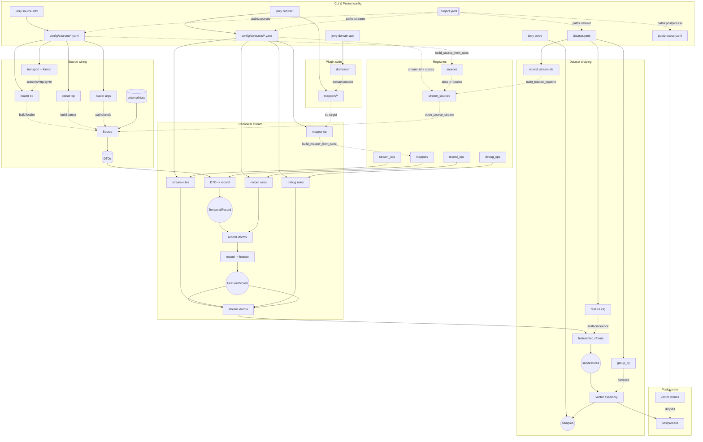

# Datapipeline Runtime

Jerry Thomas is a time-series-first data pipeline runtime. It turns declarative
YAML projects into iterators that stream records, engineered features, and
model-ready vectors. The CLI lets you preview every stage, build deterministic
artifacts, inspect quality, and scaffold plugins for custom loaders, parsers,
transforms, and filters.

> **Core assumptions**
>
> - Every record carries a timezone-aware `time` attribute and a numeric
>   `value`.
> - Grouping is purely temporal. Dimensional splits belong in `partition_by`.

---

## Why You Might Use It

- Materialize canonical time-series datasets from disparate sources.
- Preview and debug each stage of the pipeline without writing ad-hoc scripts.
- Enforce coverage/quality gates and publish artifacts (expected IDs, scaler
  stats) for downstream ML teams.
- Extend the runtime with entry-point driven plugins for domain-specific I/O or
  feature engineering.
- Consume vectors directly from Python via iterators, Pandas DataFrames, or
  `torch.utils.data.Dataset`.

---

## Quick Start

### Serve The Example

```bash
pip install jerry-thomas
jerry plugin init my-datapipeline --out lib/
jerry serve --limit 3
```

### Create Your Own Stream

Assumes you already ran `jerry plugin init ...` in this workspace (it writes `jerry.yaml` which the CLI uses for defaults and scaffolding paths).
These scaffolding commands write YAML into the dataset selected by `default_dataset` in `jerry.yaml` (`example` by default).

```bash
jerry source add demo weather -t fs -f csv
jerry domain add weather
jerry contract
pip install -e lib/my-datapipeline
```

---

## CLI Cheat Sheet

- `jerry plugin init <name> --out lib/`: scaffolds `lib/<name>/` and writes workspace `jerry.yaml`.
- `jerry.yaml` (created by `plugin init`): sets `plugin_root` for scaffolding commands and `datasets/default_dataset` so you can omit `--project`/`--dataset`.
- `jerry serve [--dataset <alias>|--project <path>] [--limit N] [--stage 0-7] [--skip-build]`: streams output; builds required artifacts unless `--skip-build`.
- `jerry build [--dataset <alias>|--project <path>] [--force]`: materializes artifacts (schema, scaler, expected IDs, etc.).
- `jerry inspect report|matrix|partitions|expected [--dataset <alias>|--project <path>]`: quality and metadata helpers.
- `jerry source add <provider> <dataset> -t fs|http|synthetic -f csv|json|json-lines|pickle [--identity]`: scaffolds a source YAML and (unless `--identity`) a parser + entry point.
- `jerry domain add <domain>`: scaffolds domain models under `src/<package>/domains/<domain>/`.
- `jerry contract [--identity]`: interactive contract scaffolder; most users pick `[1] Ingest (source → stream)` (use `[2] Composed` for derived streams, e.g. air_density from temp + pressure).
- `pip install -e lib/<name>`: rerun after commands that update `lib/<name>/pyproject.toml` (entry points), or after manual edits to it.

---

## Concepts

### Workspace (`jerry.yaml`)

- `datasets`: dataset aliases → `project.yaml` paths (relative to `jerry.yaml`).
- `default_dataset`: which dataset `jerry serve/build/inspect` use when you omit `--dataset/--project`.
- `plugin_root`: where scaffolding commands write Python code (`src/<package>/...`) and where they look for `pyproject.toml`.

### Plugin Package (Python Code)

These live under `lib/<plugin>/src/<package>/`:

- `sources/<provider>/<dataset>/dto.py` + `parser.py`: source DTO + parser (created by `jerry source add` unless `--identity`).
- `domains/<domain>/model.py`: domain records (created by `jerry domain add`).
- `mappers/<provider>/<dataset>/to_<domain>.py`: DTO → domain record mapping (usually created by `jerry contract`).
- `pyproject.toml`: entry points for loaders/parsers/mappers/transforms (rerun `pip install -e lib/<plugin>` after changes).

### Loaders & Parsers

- A **loader** yields raw rows (bytes/dicts) from some transport (FS/HTTP/synthetic/etc.).
- A **parser** turns each raw row into a typed DTO (or returns `None` to drop a row).
- In most projects, your source YAML uses the built-in loader `core.io` and you only customize its `args` (`transport`, `format`, and a `path`/`url`).
- You typically only implement a custom loader when you need specialized behavior (auth/pagination/rate limits, proprietary formats, or non-standard protocols).
- `parser.args` are optional and only used when your parser supports configuration; many parsers don’t need any args.

### Dataset Project (YAML Config)

These live under the dataset “project root” directory (the folder containing `project.yaml`):

- `project.yaml`: paths + globals (single source of truth).
- `sources/*.yaml`: raw sources (loader + parser wiring).
- `contracts/*.yaml`: canonical streams (ingest or composed).
- `dataset.yaml`: feature/target declarations.
- `postprocess.yaml`: vector-level transforms.
- `tasks/*.yaml`: serve presets and artifact task configs.

### Configuration & Resolution Order

Defaults are layered so you can set global preferences once, keep dataset/run
files focused on per-project behavior, and still override anything from the CLI.
For both `jerry serve` and `jerry build`, options are merged in the following
order (highest precedence first):

1. **CLI flags** – anything you pass on the command line always wins.
2. **Project task files** – `kind: serve` specs (under `project.paths.tasks`)
   supply serve defaults; artifact tasks in the same directory drive `jerry build`.
3. **`jerry.yaml` command blocks** – settings under `jerry.serve` and `jerry.build`.
4. **`jerry.yaml.shared`** – shared fallbacks for visuals/progress/log-level style settings.
5. **Built-in defaults** – runtime hard-coded defaults.

---

## YAML Config Reference

All dataset configuration is rooted at a single `project.yaml` file. Other YAML files are discovered via `project.paths.*` (relative to `project.yaml` unless absolute).

### `project.yaml`

```yaml
version: 1
name: default
paths:
  streams: ./contracts
  sources: ./sources
  dataset: dataset.yaml
  postprocess: postprocess.yaml
  artifacts: ../build/datasets/${project_name}
  tasks: ./tasks
globals:
  start_time: 2021-01-01T00:00:00Z
  end_time: 2023-01-03T23:00:00Z
  split:
    mode: hash # hash | time
    key: group # group | feature:<id>
    seed: 42
    ratios: { train: 0.8, val: 0.1, test: 0.1 }
```

- `name` provides a stable identifier you can reuse inside config files via `${project_name}`.
- `paths.*` are resolved relative to the project file unless absolute; they also support `${var}` interpolation.
- `globals` provide values for `${var}` interpolation across YAML files. Datetime
  values are normalized to strict UTC `YYYY-MM-DDTHH:MM:SSZ`.
- `split` config defines how labels are assigned; serve tasks or CLI flags pick the active label via `keep`.
- `paths.tasks` points to a directory of task specs. Each `*.yaml` file declares `kind: ...`
  (`scaler`, `schema`, `metadata`, `serve`, …). Artifact tasks drive `jerry build`; command
  tasks (currently `kind: serve`) provide presets for `jerry serve`. When multiple serve tasks
  exist, `jerry serve --run <name>` selects by `name`/filename stem.
- Label names are free-form: match whatever keys you declare in `split.ratios` (hash) or `split.labels` (time).

### Serve Tasks (`tasks/serve.<name>.yaml`)

```yaml
kind: serve
name: train # defaults to filename stem when omitted
keep: train # select active split label (null disables filtering)
output:
  transport: stdout # stdout | fs
  format: print # print | json-lines | json | csv | pickle
limit: 100 # cap vectors per serve run (null = unlimited)
throttle_ms: null # milliseconds to sleep between emitted vectors
# Optional overrides:
# log_level: INFO   # DEBUG=progress bars, INFO=spinner, WARNING=quiet
# visuals: AUTO     # AUTO | TQDM | RICH | OFF
# progress: AUTO    # AUTO | SPINNER | BARS | OFF
```

- Each serve task lives alongside artifact tasks under `paths.tasks`. Files are independent—no special directory structure required.
- `output`, `limit`, `throttle_ms`, and `log_level` provide defaults for `jerry serve`; CLI flags still win per invocation (see _Configuration & Resolution Order_). For filesystem outputs, set `transport: fs`, `directory: /path/to/root`, and omit file names—each run automatically writes to `<directory>/<run_name>/<run_name>.<ext>` unless you override the entire `output` block with a custom `filename`.
- Override `keep` (and other fields) per invocation via `jerry serve ... --keep val` etc.
- Visuals backend: set `visuals: AUTO|TQDM|RICH|OFF` in the task or use `--visuals`. Pair with `progress: AUTO|SPINNER|BARS|OFF` or `--progress` to control progress layouts.
- Add additional `kind: serve` files to the tasks directory for other splits (val/test/etc.); `jerry serve` runs each enabled file unless you pass `--run <name>`.
- Use `jerry.yaml` next to the project or workspace root to define shared defaults (visuals/progress/log level/output); CLI flags still take precedence.

### Workspace Defaults (`jerry.yaml`)

Create an optional `jerry.yaml` in the directory where you run the CLI to share settings across commands. The CLI walks up from the current working directory to find the first `jerry.yaml`.

```yaml
plugin_root: lib/my-datapipeline # plugin workspace (relative to this file)

# Dataset aliases for --dataset; values may be dirs (auto-append project.yaml).
datasets:
  example: lib/my-datapipeline/example/project.yaml
default_dataset: example

shared:
  visuals: AUTO # AUTO | TQDM | RICH | OFF
  progress: BARS # AUTO | SPINNER | BARS | OFF
  log_level: INFO

serve:
  limit: null
  stage: null
  output:
    transport: stdout
    format: print # print | json-lines | json | csv | pickle
    # directory: artifacts/serve # Required when transport=fs

build:
  mode: AUTO # AUTO | FORCE | OFF
```

`jerry.yaml` sits near the root of your workspace, while dataset-specific overrides still live in individual `tasks/serve.*.yaml` files as needed.

### `<project_root>/sources/<alias>.yaml`

Each file defines a loader/parser pair exposed under `<alias>`. Files may live in nested
subdirectories under `<project_root>/sources/`; discovery is recursive.

```yaml
# Source identifier (commonly `provider.dataset`). Contracts reference this under `source:`.
id: stooq.ohlcv
parser:
  # Parser entry point name (registered in your plugin’s pyproject.toml).
  entrypoint: stooq.ohlcv
loader:
  # Most common loader: core.io (supports fs/http via args.transport + args.format).
  entrypoint: core.io
  args:
    transport: http
    format: csv
    url: "https://stooq.com/q/d/l/?s=aapl.us&i=d"
```

- `id`: the source alias; referenced by contracts under `source:`.
- `parser.entrypoint`: which parser to use; `parser.args` are optional.
- `loader.entrypoint`: which loader to use; `core.io` is the default for fs/http and is configured via `loader.args`.

#### Fan-out Sources (`core.foreach`)

Use `core.foreach` to expand any inner loader spec across a list without duplicating YAML. It interpolates string args and optionally injects the foreach value into each row.

```yaml
loader:
  entrypoint: core.foreach
  args:
    foreach:
      symbol: [AAPL, MSFT]
    inject_field: symbol
    loader:
      entrypoint: core.io
      args:
        transport: http
        format: csv
        url: "https://stooq.com/q/d/l/?s=${symbol}&i=d"
```

### `<project_root>/contracts/<stream_id>.yaml`

Canonical stream contracts describe how the runtime should map and prepare a
source. Use folders to organize by domain.

```yaml
kind: ingest
id: equity.ohlcv # stream identifier (domain.dataset[.variant])
source: stooq.ohlcv # references sources/<alias>.yaml:id

mapper:
  entrypoint: equity.ohlcv
  args: {}

partition_by: station
sort_batch_size: 50000

record:
  - filter: { operator: ge, field: time, comparand: "${start_time}" }
  - filter: { operator: lt, field: time, comparand: "${end_time}" }
  - floor_time: { cadence: 10m }

stream:
  - ensure_cadence: { cadence: 10m }
  - granularity: { mode: mean }
  - fill: { statistic: median, window: 6, min_samples: 2 }

debug:
  - lint: { mode: warn, tick: 10m }
```

- `record`: ordered record-level transforms (filters, floor/lag, custom
  transforms registered under the `record` entry-point group).
- `stream`: transforms applied after feature wrapping, still per base feature.
- `debug`: instrumentation-only transforms (linters, assertions).
- `partition_by`: optional keys used to suffix feature IDs (e.g., `temp__@station_id:XYZ`).
- `sort_batch_size`: chunk size used by the in-memory sorter when normalizing
  order before stream transforms.

### Composed Streams (Engineered Domains)

Define engineered streams that depend on other canonical streams directly in contracts. The runtime builds each input to stage 4 (ordered + regularized), stream‑aligns by partition + timestamp, runs your composer, and emits fresh records for the derived stream.

```yaml
# contracts/air_density.processed.yaml
kind: composed
id: air_density.processed
inputs:
  - pressure.processed
  - t=temp_dry.processed
partition_by: station_id
sort_batch_size: 20000

mapper:
  # Function or class via dotted path; entry points optional
  entrypoint: mypkg.domains.air_density:compose_to_record
  args:
    driver: pressure.processed # optional; defaults to first input

# Optional post‑compose policies (run after composition like any stream)
# record: [...]
# stream: [...]
# debug:  [...]
```

Dataset stays minimal — features only reference the composed stream:

```yaml
# dataset.yaml
group_by: 1h
features:
  - id: air_density
    record_stream: air_density.processed
```

Notes:

- Inputs always reference canonical stream_ids (not raw sources).
- The composed source outputs records; its own `record`/`stream`/`debug` rules still apply afterward.
- Partitioning for the engineered domain is explicit via `partition_by` on the composed contract.

### `dataset.yaml`

Defines which canonical streams become features/targets and the vector bucketing.

```yaml
group_by: 1h

features:
  - id: close
    record_stream: equity.ohlcv
    scale: true
    sequence: { size: 6, stride: 1 }

targets:
  - id: returns_1d
    record_stream: equity.ohlcv
```

- `group_by` controls the cadence for vector partitioning (accepts `Xm|min|Xh`
  — minutes or hours).
- `scale: true` inserts the standard scaler feature transform (requires scaler
  stats artifact or inline statistics).
  - Downstream consumers can load the `scaler.pkl` artifact and call
    `StandardScaler.inverse_transform` (or `StandardScalerTransform.inverse`)
    to undo scaling.
- `sequence` emits `FeatureRecordSequence` windows (size, stride, optional
  cadence enforcement via `tick`).

### `postprocess.yaml`

Project-scoped vector transforms that run after assembly and before serving.

```yaml
- drop:
    axis: horizontal
    payload: features
    threshold: 0.95
- fill:
    statistic: median
    window: 48
    min_samples: 6
- replace:
    payload: targets
    value: 0.0
```

- Each transform receives a `Sample`; set `payload: targets` when you want to
  mutate label vectors, otherwise the feature vector is used.
- Vector transforms rely on the schema artifact (for expected IDs/cadence)
  and scaler stats when scaling is enabled. When no transforms are configured
  the stream passes through unchanged.

### Task Specs (`tasks/*.yaml`)

Declare artifact and command tasks under `project.paths.tasks` (default `tasks/`).
Artifact specs are optional; if you omit them, Jerry falls back to built-in defaults.
Add a YAML file only when you need to override paths or other parameters.

`tasks/scaler.yaml`

```yaml
kind: scaler
output: scaler.pkl
split_label: train
enabled: true
```

- `scaler.pkl` is a pickled standard scaler fitted on the requested split.
- `schema.json` (from the `schema` task) enumerates the discovered feature/target identifiers (including partitions), their kinds (scalar/list), and cadence hints used to enforce ordering downstream.
  - Configure the `schema` task to choose a cadence strategy (currently `max`). Per-feature overrides will be added later; for now every list-valued feature records the max observed length as its enforcement target.
- `metadata.json` (from the `metadata` task) captures heavier statistics—present/null counts, inferred value types, list-length histograms, per-partition timestamps, and the dataset window. Configure `metadata.window_mode` with `union|intersection|strict|relaxed` (default `intersection`) to control how start/end bounds are derived. `union` considers base features, `intersection` uses their overlap, `strict` intersects every partition, and `relaxed` unions partitions independently.
- Command tasks (`kind: serve`) live alongside artifact tasks; `jerry serve` reads them directly.
- Shared run/build defaults (visuals/progress/log level/build mode) live in `jerry.yaml`.

---

## CLI Reference

All commands live under the `jerry` entry point (`src/datapipeline/cli/app.py`).
Pass `--help` on any command for flags.

### Preview Stages

- `jerry serve --project <project.yaml> --stage <0-7> --limit N [--log-level LEVEL] [--visuals auto|tqdm|rich|off] [--progress auto|spinner|bars|off]`
  - Stage 0: raw DTOs
  - Stage 1: domain `TemporalRecord`s
  - Stage 2: record transforms applied
  - Stage 3: feature records (before sort/regularization)
  - Stage 4: feature regularization (post stream transforms)
  - Stage 5: feature transforms/sequence outputs
  - Stage 6: vectors assembled (no postprocess)
  - Stage 7: vectors + postprocess transforms
  - Use `--log-level DEBUG` for progress bars, `--log-level INFO` for spinner + prints, or the default (`WARNING`) for minimal output.
  - Ensures build artifacts are current before streaming; the build step only runs when the configuration hash changes unless you pass `--stage` 0-5 (auto-skip) or opt out with `--skip-build`.
- `jerry serve --project <project.yaml> --out-transport stdout --out-format json-lines --limit N [--include-targets] [--log-level LEVEL] [--visuals ...] [--progress ...] [--run name]`
  - Applies postprocess transforms and optional dataset split before emitting.
  - Use `--out-transport fs --out-format json-lines --out-path build/serve` (or `csv`, `pickle`, etc.) to write artifacts to disk instead of stdout; files land under `<out-path>/<run_name>/`.
- `--out-payload vector` emits only the vector payload with features/targets
  flattened into schema-ordered lists (no identifier keys) when you don't need
  the group key or metadata. Default is `sample`.
  - Set `--log-level DEBUG` (or set your serve task `log_level: DEBUG`) to reuse the tqdm progress bars when previewing stages.
  - When multiple serve tasks exist, add `--run val` (task name or filename stem) to target a single config; otherwise every enabled task is executed sequentially.
  - Argument precedence follows the order described under _Configuration & Resolution Order_.
  - Combine with `--skip-build` when you already have fresh artifacts and want to jump straight into streaming.

### Build & Quality

- `jerry inspect report --project <project.yaml> [--threshold 0.95] [--include-targets]`
  - Prints coverage summary (keep/below lists) and writes `coverage.json` under
    the artifacts directory.
  - Add `--matrix csv|html` to persist an availability matrix.
- `jerry inspect partitions --project <project.yaml> [--include-targets]`
  - Writes discovered partition suffixes to `partitions.json`.
- `jerry inspect expected --project <project.yaml> [--include-targets]`
  - Writes the full set of observed feature IDs to `expected.txt` (for external tooling; runtime uses `schema.json`).
- `jerry build --project <project.yaml> [--force] [--visuals ...] [--progress ...]`
  - Regenerates artifact tasks declared under `project.paths.tasks` when the configuration hash changes.

### Scaffolding & Reference

- `jerry plugin init <package> --out <dir>` (also supports `-n/--name`)
  - Generates a plugin project (pyproject, package skeleton, config templates).
- `jerry source add <provider> <dataset> --transport fs|http|synthetic --format csv|json|json-lines|pickle`
  - Also supports `<provider>.<dataset>` via `--alias` or as the first positional
  - Flag form remains available: `--provider/--dataset`
  - Creates loader/parser stubs, updates entry points, and drops a matching
    source YAML.
- `jerry domain add <name>` (also supports `-n/--name`)
  - Adds a `domains/<name>/` package with a `model.py` stub.
- `jerry filter create --name <identifier>`
  - Scaffolds an entry-point-ready filter (helpful for custom record predicates).
- `jerry list sources|domains`
  - Introspect configured source aliases or domain packages.

---

## Transform & Filter Library

### Record Filters (`config/contracts[].record`)

- Binary comparisons: `eq`, `ne`, `lt`, `le`, `gt`, `ge` (timezone-aware for ISO
  or datetime literals).
- Membership: `in`, `nin`.
  ```yaml
  - filter: { operator: ge, field: time, comparand: "${start_time}" }
  - filter: { operator: in, field: station, comparand: [a, b, c] }
  ```

### Record Transforms

- `floor_time`: snap timestamps down to the nearest cadence (`10m`, `1h`, …).
- `lag`: add lagged copies of records (see `src/datapipeline/transforms/record/lag.py` for options).

### Stream (Feature) Transforms

- `ensure_cadence`: backfill missing ticks with `value=None` records to enforce a
  strict cadence.
- `granularity`: merge duplicate timestamps using `first|last|mean|median`.
- `dedupe`: drop exact duplicate records (same id, timestamp, and payload) from
  an already sorted feature stream.
- `fill`: rolling statistic-based imputation within each feature stream.
- Custom transforms can be registered under the `stream` entry-point group.

### Feature Transforms

- `scale`: wraps `StandardScalerTransform`. Read statistics from the build
  artifact or accept inline `statistics`.
  ```yaml
  scale:
    with_mean: true
    with_std: true
    statistics:
      temp_c__station=001: { mean: 10.3, std: 2.1 }
  ```

### Sequence Transforms

- `sequence`: sliding window generator (`size`, `stride`, optional `cadence` to
  enforce contiguous windows). Emits `FeatureRecordSequence` payloads with `.records`.

### Vector (Postprocess) Transforms

- `drop`: apply coverage thresholds along the horizontal axis (vectors) or
  vertical axis (features/partitions) using `axis: horizontal|vertical` and
  `threshold`. Vertical mode requires the optional `metadata.json`
  artifact and internally prunes weak partitions.
- `fill`: impute using rolling statistics from prior vectors (history-based).
- `replace`: seed missing IDs with a constant or literal value.
  (Jerry automatically enforces the `schema.json` vector schema—ordering +
  cadence—before any configured vector transforms run.)

All transforms share a consistent entry-point signature and accept their config
dict as keyword arguments. Register new ones in `pyproject.toml` under the
appropriate group (`record`, `stream`, `feature`, `sequence`, `vector`,
`filters`, `debug`).

---

## Artifacts & Postprocess

- `expected.txt`: newline-delimited full feature IDs, generated on demand via
  `jerry inspect expected`. Not required at runtime; transforms derive the
  expected universe from `schema.json`.
- `schema.json`: output of the `schema` task. Jerry automatically
  enforces this schema during postprocess to impose deterministic ordering and
  list cadence metadata (targets appear whenever the dataset defines them). Window metadata now lives in `metadata.json`.
- `scaler.pkl`: pickled standard scaler fitted on the configured split. Loaded
  lazily by feature transforms at runtime.
- Build state is tracked in `artifacts/build/state.json`; config hashes avoid
  redundant runs.

If a postprocess transform needs an artifact and it is missing, the runtime will
raise a descriptive error suggesting `jerry build`.

---

## Splitting & Serving

If `project.globals.split` is present, `jerry serve` filters vectors at the
end of the pipeline:

- `mode: hash` – deterministic entity hash using either the group key or a
  specified feature ID.
- `mode: time` – boundary-based slicing using timestamp labels.
- `run.keep` (or CLI `--keep`) selects the active slice; use any label name defined in your split config.

The split configuration never mutates stored artifacts; it is only applied when
serving vectors (either via CLI or the Python integrations).

---

## Python Integrations

`datapipeline.integrations.ml` demonstrates how to reuse the runtime from
application code:

- `VectorAdapter.from_project(project_yaml)` – bootstrap once, then stream
  vectors or row dicts.
- `stream_vectors(project_yaml, limit=...)` – iterator matching `jerry serve`.
- `iter_vector_rows` / `collect_vector_rows` – handy for Pandas or custom sinks.
- `dataframe_from_vectors` – eager helper that returns a Pandas DataFrame
  (requires `pandas`).
- `torch_dataset` – builds a `torch.utils.data.Dataset` that yields tensors. See
  `examples/minimal_project/run_torch.py` for usage.

---

## Extending the Runtime

### Entry Points

Register custom components in your plugin’s `pyproject.toml`:

```toml
[project.entry-points."datapipeline.loaders"]
demo.csv_loader = "my_datapipeline.loaders.csv:CsvLoader"

[project.entry-points."datapipeline.parsers"]
demo.weather_parser = "my_datapipeline.parsers.weather:WeatherParser"

[project.entry-points."datapipeline.mappers"]
time.ticks = "my_datapipeline.mappers.synthetic.ticks:map"

[project.entry-points."datapipeline.stream"]
weather.fill = "my_datapipeline.transforms.weather:CustomFill"
```

Loader, parser, mapper, and transform classes should provide a callable
interface (usually `__call__`) matching the runtime expectations. Refer to the
built-in implementations in `src/datapipeline/sources/`, `src/datapipeline/transforms/`,
and `src/datapipeline/filters/`.

### Scaffolding Helpers

- `datapipeline.services.scaffold.plugin.scaffold_plugin` – invoked by
  `jerry plugin init`.
- `datapipeline.services.scaffold.source.create_source` – writes loader/parser
  stubs and updates entry points.
- `datapipeline.services.scaffold.domain.create_domain` – domain DTO skeleton.
- `datapipeline.services.scaffold.filter.create_filter` – custom filter stub.
- `datapipeline.services.scaffold.mappers.attach_source_to_domain` – helper for
  programmatically wiring sources to domain mappers and emitting stream
  contracts (useful in custom automation or tests).

---

## Development Workflow

- Install dependencies: `pip install -e .[dev]`.
- Run tests: `pytest`.
- When iterating on configs, use `jerry serve --stage <n>` to peek into problematic
  stages.
- After tuning transforms, refresh artifacts: `jerry build`.
- Use `jerry inspect report --include-targets` to ensure targets meet coverage
  gates before handing vectors to downstream consumers.

---

## Additional Resources

- `src/datapipeline/analysis/vector_analyzer.py` – quality metrics collected by
  the inspect commands.
- `src/datapipeline/pipeline/` – pure functions that wire each stage.
- `src/datapipeline/services/bootstrap/` – runtime initialization and
  registry population (see `core.py`).
- `examples/minimal_project/` – runnable demo showing config layout and Torch
  integration.

---

## Pipeline Architecture (WIP)

```text
raw source ──▶ loader/parser DTOs ──▶ canonical stream ──▶ record policies
      └──▶ feature wrapping ──▶ stream regularization ──▶ feature transforms/sequence
      └──▶ vector assembly ──▶ postprocess transforms
```

1. **Loader/parser (Stage 0)** – raw bytes become typed DTOs. Loaders fetch from
   FS/HTTP/synthetic sources; parsers map bytes to DTOs. Register them via entry
   points (`loaders`, `parsers`) and wire them in `config/sources/*.yaml`.
2. **Canonical stream mapping (Stage 1)** – mappers attach domain semantics and
   partition keys, producing domain `TemporalRecord`s.
3. **Record policies (Stage 2)** – contract `record` rules (filters, floor, lag)
   prune and normalize DTO-derived records.
4. **Feature wrapping (Stage 3)** – records become `FeatureRecord`s before
   sort/regularization.
5. **Stream regularization (Stage 4)** – contract `stream` rules ensure cadence,
   deduplicate timestamps, and impute where needed.
6. **Feature transforms/sequence (Stage 5)** – dataset transforms (scale,
   sequence windows) produce per-feature tensors or windows.
7. **Vector assembly (Stage 6)** – features merge by `group_by` cadence into
   `(group_key, Vector)` pairs, prior to postprocess tweaks.
8. **Postprocess (Stage 7)** – optional vector transforms (fill/drop/etc.) run
   before results are emitted to the configured output.

#### Visual Flowchart


