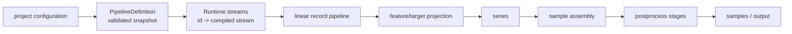

# Pipeline Architecture

Each command reads and validates the project, dataset, source, stream,
and operation YAML once into a `PipelineDefinition`. That definition is the
command's configuration snapshot. Planning, validation, artifact hydration,
and execution do not re-read configuration or environment values. Changes are
picked up by the next command. Its per-artifact hashes cover each producer's
typed dependency and source closure plus the project's artifact revision.
Mutable `Runtime`
instances are compiled from the definition without reading configuration files.

## Runtime streams

Every canonical stream ID has exactly one entry in `Runtime.streams`:
`SourceRuntimeStream`, `DerivedRuntimeStream`, `BroadcastRuntimeStream`, or
`AlignedRuntimeStream`.

A source-backed stream owns an external source, mapper, preprocess operations,
partition identity, and ordering policy. A derived stream names one upstream
stream and adds ordered transforms. A broadcast stream attaches an
unpartitioned temporal input to a partitioned primary input. An aligned stream
intersects two or more inputs with the same partition identity. Both fan-in
stream kinds own a prepared combine stage and inherit partition identity; only
source-backed streams declare it. Single-input streams are flattened, while
broadcast and aligned streams use the explicit boundaries described below. The
strict config models keep source mapping and fan-in behavior separate.

Dataset `sample.keys` select the partition fields represented in row identity.
The remaining partition fields deterministically suffix series IDs in declared
order. This derives long, wide, and hybrid layouts without a separate stream
series-identity setting.

Configured loader, parser, map, and combine entry points are resolved while
compiling a runtime from the definition. The resulting callables are stored on the runtime stream. There are
no parallel source, mapper, transform, or debug registries to keep synchronized.



## Stream pipelines

A source-backed stream is one source followed by explicit stages:

```text
stream:<id>
  input: open_source
  stage: map_records
  <one stage per configured preprocess transform>
  stage: order_records
  <one stage per configured ordered transform>
```

A single-input derived stream flattens its upstream pipeline into the same run. The
upstream names are qualified, so debug output identifies both the root stream
and the stage that produced a record:

```text
stream:<id>
  input: stream:<upstream>/open_source
  stage: stream:<upstream>/map_records
  stage: stream:<upstream>/...
  <one stage per configured ordered transform>
```

The derived stream reuses upstream canonical order directly. It does not add
identity mapping or sorting stages.

Aligned streams are a symmetric fan-in boundary. Their pipeline input is
`align_inputs`; it owns opening, validating, merging, and closing the configured
ordered inputs.
Those input pipelines run internally without starting competing visual pipelines.
The aligned pipeline remains the single observable boundary: `align_inputs` reports
its current progress, then `combine_records` applies the configured combine
function before ordered transforms.

Broadcast streams are the asymmetric fan-in boundary. Their `broadcast_inputs`
pipeline input fully indexes one finite, unpartitioned input by time,
then pairs each partitioned primary record with the exact timestamp match. It
rejects missing, duplicate, and unordered keys, but ignores indexed timestamps
that the primary never uses. Index memory is proportional to the number of
broadcast records. `combine_records` receives read-only inputs; the indexed
broadcast record object is reused across primary partitions at that timestamp.

The runner accepts one explicit input followed by ordered stages. It owns lazy
iteration, closing, output counts, timings, and sampled progress. It has no
generic fan-out, keyword-input, nested-parent, or nested-pipeline
machinery.

Preprocess and ordered transform configuration is a strict discriminated union. Each
entry names its built-in operation directly:

```yaml
preprocess:
  - operation: floor_time
    cadence: 1d

transforms:
  - operation: rolling
    field: close
    window: 20
    statistic: mean
```

Pydantic validates operation-specific fields and rejects extras before the pipeline
is built. Pipeline construction uses explicit type dispatch to create the transform.
There is no generic transform engine, signature inspection, arbitrary keyword
injection, transform plugin lookup, or debug transform registry.

Sequence construction remains a series-pipeline stage rather than preprocess
or an ordered stream transform. Scaling is applied later, after a dataset fold
is selected, so every train, validation, and test output uses its fold's fitted
scaler. This keeps stream normalization separate from dataset shaping and split
policy.

## Vector postprocess

`dataset.yaml:postprocess` is validated into `PostprocessConfig`, with separate
typed policies for feature selection, target selection, and sample filtering.

The dataset pipeline has one fixed postprocess order:

```text
dataset
  assemble_samples
  optional select_features
  optional select_targets
  normalize_features
  normalize_targets (or reject_undeclared_targets)
  optional filter_samples_by_features
  optional filter_samples_by_targets
```

Configuration can enable and parameterize selection and filtering, but cannot
reorder phases or mutate vector values. Vector metadata is loaded once at the
boundary where its validated contract is needed.

## Preview boundaries

`jerry serve --preview` selects a semantic boundary rather than an execution
position: `input`, `canonical`, `records`, `series`, `samples`, or `postprocess`.
The meaning stays stable when optional pipeline stages are added or removed. See the
README's **Preview stages** section for the output behavior of each boundary.
