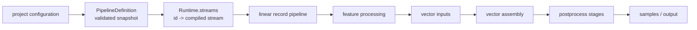

# Pipeline Architecture

Each command reads and validates the project, dataset, source, ingest, stream,
and operation YAML once into a `PipelineDefinition`. That definition is the
command's configuration snapshot. Planning, validation, artifact hydration,
and execution do not re-read configuration or environment values. Changes are
picked up by the next command. Its per-artifact hashes cover each producer's
typed dependency and source closure plus the project's artifact revision.
Mutable `Runtime`
instances are compiled from the definition without reading configuration files.

## Runtime streams

Every canonical stream ID has exactly one entry in `Runtime.streams`:
`IngestRuntimeStream`, `DerivedRuntimeStream`, or `AlignedRuntimeStream`.

An ingest owns an external source. A derived stream names one upstream stream;
an aligned stream names two or more inputs. Ingests and derived streams keep a
prepared iterator mapper; aligned streams keep their prepared combine stage. All
three keep typed transforms, complete series identity (`partition_by`), and
ordering policy (`presorted`) together. There is no generic source adapter that
hides another pipeline. Single-input streams are flattened; aligned streams use
the explicit fan-in boundary described below. Their strict config models make
`map` and `combine` mutually exclusive. Single-input streams inherit partition
identity when it is omitted; an explicit list replaces the inherited value.

Dataset `sample.keys` select the partition fields represented in row identity.
The remaining partition fields deterministically suffix feature IDs in declared
order. This derives long, wide, and hybrid layouts without a separate stream
feature-identity setting.

Configured loader, parser, map, and combine entry points are resolved while
compiling a runtime from the definition. The resulting callables are stored on the runtime stream. There are
no parallel `stream_sources`, `mappers`, record-operation,
stream-operation, or debug-transform registries to keep synchronized.



## Record and stream pipelines

An ingest is one source followed by ordered stages:

```text
ingest:<id>
  open_source
  map_records
  <one node per configured record transform>
  order_records
```

A single-input derived stream flattens its upstream pipeline into the same run. The
upstream names are qualified, so debug output identifies both the root stream
and the stage that produced a record:

```text
stream:<id>
  ingest:<upstream>/open_source
  ingest:<upstream>/map_records
  ingest:<upstream>/...
  map_records
  order_records
  <one node per configured stream transform>
```

Aligned streams are the one real fan-in boundary. Their root source node is
`align_inputs`; it owns opening, validating, merging, and closing the configured
ordered inputs.
Those input pipelines run internally without starting competing visual pipelines.
The aligned root remains the single observable pipeline: `align_inputs` reports
its current progress, then `combine_records` applies the configured combine
function before canonical ordering and stream transforms.

The runner accepts only a source followed by stream stages. It owns lazy
iteration, closing, output counts, timings, and sampled progress. It has no
generic fan-out, keyword-input, node-kind, nested-parent, or nested-pipeline
machinery.

Record and stream transform configuration is a strict discriminated union. Each
entry names its built-in operation directly:

```yaml
record:
  - operation: floor_time
    cadence: 1d

stream:
  - operation: rolling
    field: close
    window: 20
    statistic: mean
```

Pydantic validates operation-specific fields and rejects extras before the pipeline
is built. Pipeline construction uses explicit type dispatch to create the transform.
There is no generic transform engine, signature inspection, arbitrary keyword
injection, transform plugin lookup, or debug transform registry.

Feature scaling and sequence construction remain feature-pipeline stages rather
than record or stream transforms. This keeps stream normalization separate from
dataset shaping.

## Vector postprocess

`dataset.yaml:postprocess` is validated into `PostprocessConfig`, with separate
typed policies for feature selection, target selection, and sample filtering.

The serve pipeline has one fixed postprocess order:

```text
pipeline:serve
  vector_assemble
  optional select_features
  optional select_targets
  normalize_features
  normalize_targets (or reject_undeclared_targets)
  optional filter_samples_by_features
  optional filter_samples_by_targets
```

Configuration can enable and parameterize selection and filtering, but cannot
reorder phases or mutate vector values. Schema and vector metadata are loaded at
the boundary where their validated contracts are needed.

## Preview boundaries

`jerry serve --preview` selects a semantic boundary rather than a numeric node
position: `source`, `mapped`, `records`, `features`, `samples`, or `postprocess`.
The meaning stays stable when optional pipeline nodes are added or removed. See the
README's **Preview stages** section for the output behavior of each boundary.
