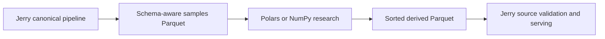

# Research Workflow

Jerry can export assembled samples as a schema-aware Parquet table for research
in Polars, NumPy, or another analytical tool. A derived table can then return as
an ordinary Jerry source. This keeps experimentation outside the streaming
runtime while preserving Jerry's validation and reproducible dataset build.



## 1. Export assembled samples

Install the optional Parquet support and the research tool separately:

```bash
python -m pip install "jerry-thomas[parquet]" polars
```

Export the `samples` preview from one serve profile:

```bash
jerry serve \
  --project path/to/project.yaml \
  --profile dataset \
  --preview samples \
  --output-transport fs \
  --output-format parquet \
  --output-directory research/export
```

Jerry prints the concrete run-scoped output path. The table uses explicit
namespaces such as `sample.time`, `sample.ticker`, `features.adv_20`, and
`targets.forward_return`.

`samples` is the useful research boundary: series have been assembled into
rows, but postprocess filtering, split routing, and fold-specific scaling have
not run. Use `--preview postprocess` when the research input should include the
configured postprocess policy.

## 2. Derive a series with Polars

This example ranks `adv_20` across tickers at each timestamp and writes one
canonical record series:

```python
from pathlib import Path
import sys

import polars as pl


samples_path = Path(sys.argv[1])
output_path = Path("research/adv_rank.parquet")
output_path.parent.mkdir(parents=True, exist_ok=True)

(
    pl.scan_parquet(samples_path)
    .select(
        pl.col("sample.time").alias("time"),
        pl.col("sample.ticker").alias("ticker"),
        pl.col("features.adv_20")
        .rank(method="average")
        .over("sample.time")
        .alias("value"),
    )
    .sort(["ticker", "time"])
    .sink_parquet(output_path)
)
```

Run it with the Parquet path printed by `jerry serve`:

```bash
python research/derive_adv_rank.py /absolute/path/to/dataset.parquet
```

Prefer native Polars expressions over Python row callbacks. Use NumPy,
scikit-learn, or statsmodels alongside Polars for algorithms that are naturally
matrix-based, such as PCA or regression.

## 3. Reingest the derived table

Declare the local Parquet file as a normal source:

```yaml
# sources/research.adv-rank.yaml
id: research.adv-rank
parser:
  entrypoint: core.temporal_record
loader:
  transport: fs
  path: research/adv_rank.parquet
  reader:
    format: parquet
```

Expose its canonical records as a stream:

```yaml
# streams/research.adv-rank.yaml
id: research.adv-rank
from:
  source: research.adv-rank
map:
  entrypoint: identity
partition_by: [ticker]
ordered_by: [ticker, time]
```

Then reference the field from `dataset.yaml`:

```yaml
features:
  - id: adv_rank
    stream: research.adv-rank
    field: value
```

The Polars script sorts by the stream's canonical order, so `ordered_by` lets
Jerry validate that order in one pass and skip external sorting. If the producer
cannot guarantee canonical order, omit `ordered_by`; Jerry will sort the stream.
Never declare `ordered_by` based only on an assumption.

The research producer remains responsible for feature semantics and leakage.
Jerry still validates timestamps, stream ordering, sample identity, metadata,
and downstream dataset contracts when the derived series is reingested.
